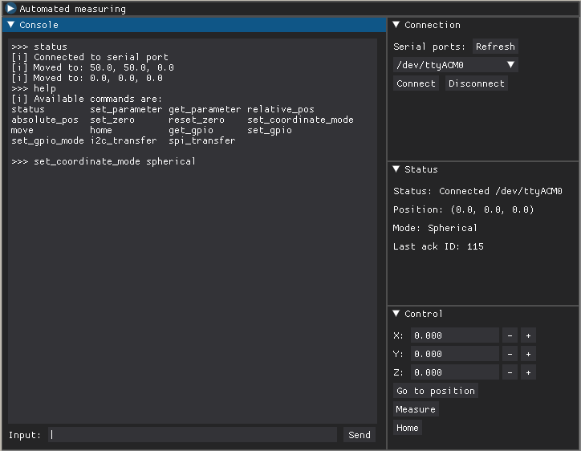

# Cube Software

PyCubeLib, a python library for communication with Cube.
Includes functionality to communicate with Cube and a basic control GUI.

## Usage

Detailed documentation [here](https://xpecak.pages.fi.muni.cz/cube/docs).
You can also look at the `example.py` on how to launch the GUI.

## License

Mozilla Public License Version 2.0